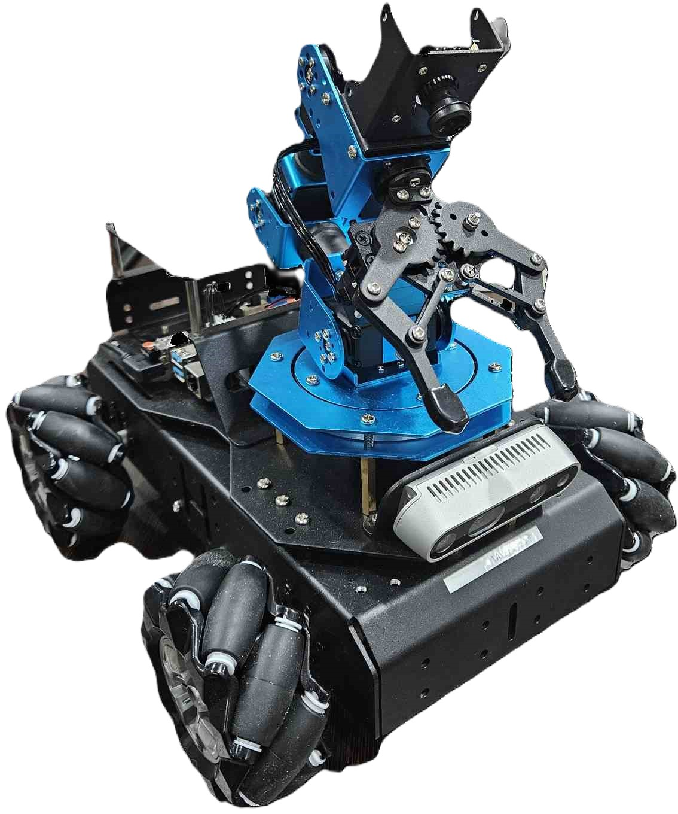
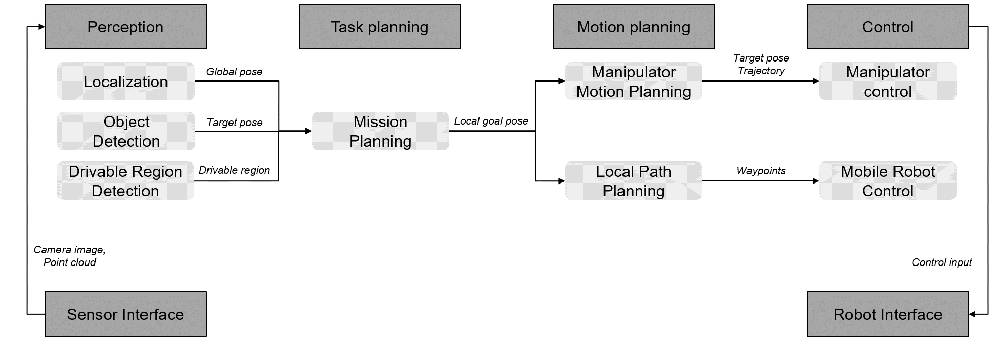

# KAIST EE405A 2024 Spring Semester
## Topic: Robot Vision and Sensing / AI-enabled autonomous rover
In this class, students are invited to build an AI-enabled autonomous rover, harnessing the latest robot vision and sensing capabilities. The rover is further empowered with GPU-powered computers for advanced intelligent behaviors. Students will learn the basics of robotics including computer vision, localization, control as well as latest deep learning based detection and decision making. Students will do individual simulation based homework and then build an autonomous rover as a small group effort. After building the robot system, students are invited write software that drives the system using latest AI technologies to perform autonomous exploration just like a real life rovers that perform useful missions. 

## Related projects
[WPI] A Robotic Solution to Safely Finding and Destroying Land Mines [Video](https://youtu.be/LhUmatv10n4?feature=shared)  
[NASA JPL] Mars Science Laboratory Curiosity Rover [Animation](https://youtu.be/P4boyXQuUIw?feature=shared)  
[RoSys Group] A mobile robotic manipulator for plastic waste collection [Video](https://youtu.be/dNyUeop_Ihc?feature=shared)  
[USRG] MBZIR-UGV Operating a Valve [Video](https://youtu.be/NRCp4iheQsg?feature=shared)  
[USRG] Autonomous Exploration and Object Detection in Complex Multi-Floor Environments [Video](https://youtu.be/ua-bf6es4ac?feature=shared)  

# Hardware platform

  

 Hiwonder ArmPi Pro 

[Link](https://www.hiwonder.com/collections/robotic-car/products/armpi-pro?variant=40308380958807)  
- 4 omni-directional mecanum wheels
- 6DOF arm (5DOF+gripper)
- FPV camera at the end-effector

  

 Intel Realsense D435 

[Link](https://www.intelrealsense.com/depth-camera-d435/)  

  

 NVIDIA® Jetson Orin™ Nano Developer Kit 

[Link](https://developer.nvidia.com/embedded/learn/get-started-jetson-orin-nano-devkit)  

# Environments
- Ubuntu 20.04
- ROS Noetic

***
# Autonomous Robot System Architecture (Example)

***